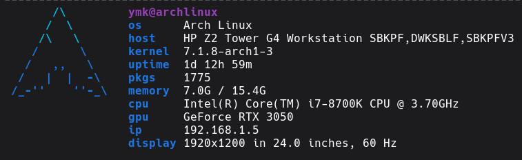

<p align="center">
  
</p>

**plusfetch** is a simple POSIX sh fetch script — a fork of [pfetch](https://github.com/dylanaraps/pfetch) with extra hardware info: RAM in GB, CPU/GPU names, local IP and display details (resolution, size, refresh rate).

<p align="center">
  
</p>

## Features

- Written in pure POSIX sh — no bash required
- Tiny and fast
- Info shown: OS, host, kernel, uptime, packages, memory (GB), CPU, GPU, local IP, display (resolution, inches, Hz)

## Install

```sh
git clone https://github.com/YOUR_USERNAME/plusfetch
cd plusfetch
sudo make install
```

Or run it directly:

```sh
./plusfetch
```

## Usage

Add it to your `.bashrc` to show it on every new terminal:

```sh
plusfetch
```

## License

MIT — see the original [pfetch](https://github.com/dylanaraps/pfetch) license.
